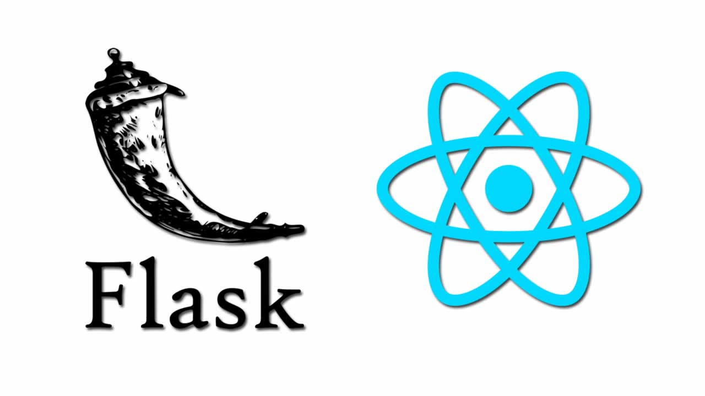
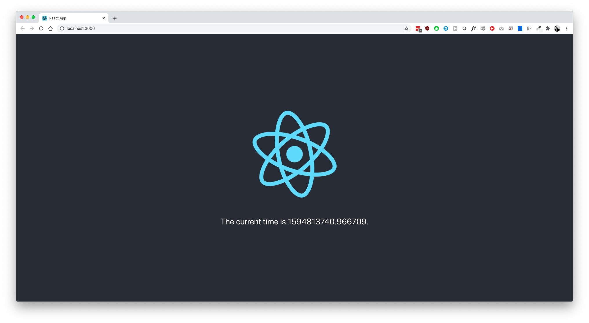

# React + Flask





This is a small demo to show how you can connect **React** and **Flask** as a
fullstack application. Another good source on this is
[this](https://blog.miguelgrinberg.com/post/how-to-create-a-react--flask-project)
post by Miguel Grinberg.

## Usage 

First install the necessary packages.

```
npm install
```

Then start the **Flask** webserver.

```
python3 server.py
```

And then in another terminal start the **React** frontend. 

```
npm start
```

Visit [http://localhost:3000](http://localhost:3000) to view it in the browser.

## Avoiding cross-origin resource sharing (CORS)

If you try to run your Flask server as a normal server and try to make an api call to it you will be blocked because of CORS. 

>Access to fetch at 'http://127.0.0.1:5000/predict/1' from origin
'http://localhost:3000' has been blocked by CORS policy: No
'Access-Control-Allow-Origin' header is present on the requested resource. If
an opaque response serves your needs, set the request's mode to 'no-cors' to
fetch the resource with CORS disabled.

There are multiple ways of solving this. One purported solution is to add
`{mode: 'no-cors'}` to your `fetch()` api call. Another solution, the solution that is used here, is to add the following to your `package.json`. 

```
{
  "proxy": "http://localhost:5000"
}
```

This is basically what is happening:

* React runs on port 3000
* Flask runs on port 5000
* Usually for frontend and backend these are the same (so they "trust" each other)
* If they are not the same they do not "trust" each other and you have cross-origin issues (CORS)
* We configure React such that it forwards all requests it receives on 3000 to 5000
* This is how we avoid the CORS issues